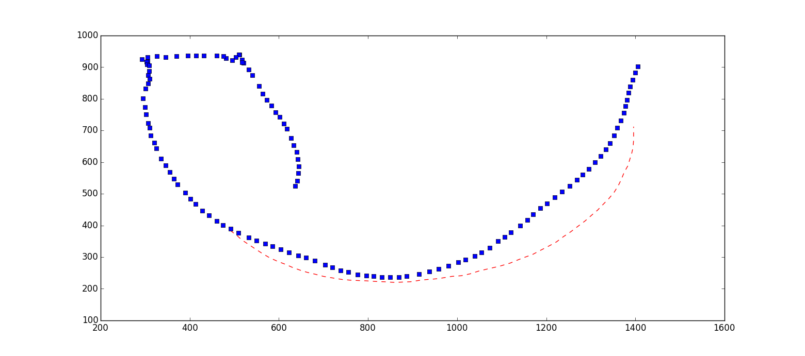
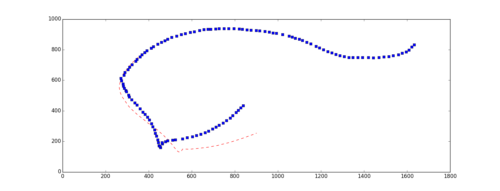

Nicholas Robinson

Yosef Hoffman 

Zachary Bienenfeld

##AI for Robotics: Final Project

#Introduction
We had two approaches to solving the final project. The first approach was by using a Kalman Filter to track the trajectory of the robot over from the time that it leaves the frame and calculate the next 60 frames. The second approach that we took was that of a Particle Filter. The application of Kalman Filter to our scenario at hand is intuitive. Applying a Particle Filter requires a little bit of imagination but the results were significant. 

We tested our results by trimming the inputs by 60 frames (1739 frames instead of 1799) and testing the result against the expected 60 ending frames. We created two gauges for our accuracy. The first was an accuracy test as specified by the instructions for calculating the best score (Pythagorean Theorem). This allowed us to gauge an objective score of how our algorithms were performing. However, the score itself was insufficient in gaining an understanding of where our robot was actually going and where it was deviating from its expected path. For that, we implemented a GUI which would pop up after a run through an input and would show the expected path versus the actual path plotted on a graph.  
#Overview 
###Kalman Filter
The Kalman Filter approach is the more classical approach to the question. Being that we have the previous movements, we can use a Kalman Filter to find a most likely next move as a Gaussian. There are two challenges which the Kalman Filter can be applied to resolve. The first is the 1 dimensional velocity of the robot. As the robot moves across the board it accelerates. When it crashes into the wall it is then slowed down and will once again gain momentum as it is free to roam. The second challenge is accounting for the 2 dimensional curving of the robot. 

As we studied in the class lectures, the Kalman Filter works with combining a measurement update (Bayes Rule) and a motion update (Total Probability). Where we are somewhat limited in the question at hand is that we never get a measurement feedback after each of our steps. We must make all of our 60 predictions without a single measurement update. In order to mitigate this problem and continue using the Kalman Filter, we must assume that each motion is the correct motion and continue with our next motion as if the measurement update retrieved was the same as the motion update. A somewhat different way of looking at it would be that the robot takes steps of 60 frames at a time and then gets feedback of its motion with a measurement. We are given the measurements up to N and must then calculate with the Kalman filter the next 60 frames. 

The Gaussian that is formed by the Kalman Filter will be a 2 dimensional oval. 1 of its axis signifies is the likelihood of how far it will go based on its velocity and acceleration, and the other axis signifies the likelihood of how much it will turn. The center will give us the highest probable location of the robot at its next frame.

In our research on Kalman Filters we came across a second form of the Kalman Filter known as the [Unscented Kalman Filter](https://en.wikipedia.org/wiki/Kalman_filter#Unscented_Kalman_filter). This type of Kalman filter is useful in the case of non-linear problems. Since our robot problem fit this description this is the Kalman Filter that we decided to pursue.

###Particle Filter
The Particle Filter approach is an extension of the particle filter we studied in class. In the class lectures, we learned about how to find the location of a robot by placing particles around the entire area where the robot could possibly lie facing in assorted directions. As the robot moves around, we apply the same motion to the particles. When the robot senses its surroundings, we are given a better understanding of which particles are likely candidates for being in the same location as the robot. 

How would we apply such a concept to the question in the final project? We are given about 30 minutes of total training videos which give us real past movements of the robot. If we use our imagination, we can picture all of the previous frames in all of the previous trainings as particles. There are enough training frames given that we have a good sampling of robot motion in every location on the board and in every direction. We can then apply that sampling against the current state of our robot. As our robot moves, we can track which previous frames are likely candidates that represent our current scenario and let the others fall off. 

In the class lectures there was a re-sampling stage in which filters that became less likely to be correct robot positions joined teams with likely robot positions and formed a heavier weighted gathering in likely positions. So too in our use of the particle filter, the unlikely “particles” or frames get dropped off and the most likely portion of training video is selected as the closest match. Once we have the closest match, following the behavior is trivial. We can apply the exact movements that we have from the training and apply it to the robot. 

In some ways this use of the particle filter is the opposite of the particle filter studied in class. For in class, the particles were following the robot so that we can assess where the likely position of the robot is. In our case, the robot (the current state) is following the particles (the previous frames). And in our case, we know the exact location of the robot at the current state, we simply wish to derive from it which is the most likely particle filter (past frame) to trace. 

As discussed in class, switching between approaches mid-run can cause a robot to quickly jerk out of position. Averaging the approaches would remove the jerkiness but would be computationally heavier and would not offer a better result, rather would supply a result that is imprecise according to both of the approaches. 

Each approach has its strength and weaknesses. The obvious strength of Kalman Filter over the Particle Filter is that the Particle Filter will only work if it finds a sufficient match in the training; if however there is no "particle" from which to base the current move, the Particle Filter will have trouble locating itself. For example, in the 7th input the robot turns over and for a period of 25 seconds is practically stationary. As we explain below, our algorithm includes the current video as training and uses them as particles. If however we chose not to use that implementation, rather to base solely on the training video, we would have no particle to base the current stationary movement on. The Kalman Filter on the other hand requires no such training. The Kalman Filter takes into account only its recent moves in ascertaining the velocity and turning direction of the robot. 
 
#Implementation
###Kalman Filter
Initially our approach to solving the problem via Kalman Filters was limited to trying to keep up with the velocity of the robot as it moved along. We began by keeping track of the position of the x,y coordinates as well as the velocity in the x and y direction. This method proved to be helpful but did not produce very good results. The issue we had when solving the problem this way was that when we got to the end of our measurement list and had to start predicting data points we could only predict a straight line as all we had to go on was velocity of the robot.

Below is our state transition function for our Constant Velocity Kalman Filter. We simply added the velocity to the current x and y positions in order to calculate the next position. This simplistic approach produced results that were not completely off base.

	def f_linear(x, dt):
    F = np.array([[1, dt, 0., 0.],
                  [0, 1, 0., 0.],
                  [0, 0, 1, dt],
                  [0, 0, 0,  1]])
    return np.dot(F, x)
    
There were a few other parameters that we had to work through when creating our KF function. One was the noise Covariance matrix. For the noise covariance matrix we used a function built into filterpy to produce a discrete time Wiener process. For the measurement noise matrix we set a small value as we were assuming no measurement noise in this problem. We also set our initial covariance matrix to relatively large values as we had no idea what the initial values for the velocity should be.

	bot_filter.Q[0:2, 0:2] = Q_discrete_white_noise(2, dt=1, var=0.1)
    bot_filter.Q[2:4, 2:4] = Q_discrete_white_noise(2, dt=1, var=0.1)
    bot_filter.P *= 500
    bot_filter.R = np.diag([0.0001, 0.0001])

###Unscented Kalman Filter
After not getting the results we wanted from a basic Kalman Filter with a Constant Velocity model we decided to explore Unscented Kalman Filters. In our reading we found that UKF were particularly well suited for nonlinear problems and were relatively simple to implement. Our readings also explained that UKF can often have better results than Extended Kalman Filters. 

We decided to pursue using UKF with a Constant Acceleration model. We believed that if we could keep track of acceleration in the x and y direction that we could keep up with the strange curving patterns that we observed happening with the robot. The function below shows our state transition function. 

	def f_cv(x, dt):
    """ state transition function for a constant velocity aircraft"""

    F = np.array([[1, dt, (0.5 * (dt**2)),  0., 0., 0.],
                  [0, 1, dt,  0., 0., 0.],
                  [0, 0, 1, 0, 0, 0],
                  [0, 0, 0,  1, dt, (0.5 * (dt**2))],
                  [0, 0, 0, 0, 1, dt],
                  [0, 0, 0, 0, 0, 1]])
    return np.dot(F, x)
 
 Another issue we ran into was trying to find a more sophisticated noise covariance matrix for our UKF. We ran across a guide online at the following [link](https://vimeo.com/87854540). We adapted the noise covariance matrix from the video and used it in our solution. The code below shows our chosen co-variance matrix.
 
 	G = np.array([[0.19*(dt**2)],
                  [dt],
                  [1.],
                  [0.19*(dt**2)],
                  [dt],
                  [1.]])
     
    Q = G*G.T*0.1**2
    
 We looked around on the internet to try to find additional models that might be helpful as well. We kept arriving back at this model due to the simplicity as well as the time limits we had on our program runtime. 
 
 

###Particle Filter

We spent some time trying to figure out how we could implement a particle filter in this scenario. In class, we had a Robot class that contained the movement logic for the robot, which made it very easy to create many "particles" that all acted exactly like the robot we were following. We thought of trying to create a similar Robot class that mimicked the robot's movement, but the robot's actual movement didn't seem to follow any rules that would be easy enough to code.

We realized that we could treat each frame of video, in both the training data and the input files, as an instance of the robot (or a particle). Then we wouldn't have to create a function to mimic the movement of the robot, as we already know how the robot would move in each of those instances. Now we just needed to decide which "particle" our robot most closely related to at the end of the clip.

To do this, we started by just looking at the ending position of the robot in the clip and finding the particle frame with the closest position. We then returned the 60 frames following that particle frame. The results were actually significantly better than the results we were able to get using the Kalman filters, so we decided to pursue this route further.

To improve this algorithm further, we looked into matching on more than one frame. We tried looking for two consecutive frames that were closest to the last two frames of the clip. This improved the scores, so we then looked for N consecutive frames that were closest to the last N frames in the clip. Once the code was written to look for N frames, we simply changed the value of N to see what value of N gave us the best scores. We discovered that scores improved until we got to N equals 6, and then scores started to decline.

Looking at a graph of the prediction on top of a plot of the clip, it was clear that the predictions were not in line with the actual position of the robot. This was because we had simply used the 60 subsequent frames of the closest particle and used them as our prediction. To fix this, we calculated the 60 subsequent x and y movements of the particle, and then applied those movements to the final position of the robot in order to create our prediction. This made our graph have a smooth transition from actual position to prediction.

One final tweak that we made to the algorithm, was taking into account the direction of the robot at the end of the clip. Up until this point, it was possible that we could find a best match that was going in the opposite direction of our robot, and then the prediction would be way off. Now, when looking for a best match, we first check to make sure that the final direction of the particle is going in the same general direction as the particle. More specifically, we checked that the particle's velocity in the x and y directions had the same signs as the robot's velocity in the x and y directions.

#Results
###Kalman Filter

Below is an example of a resulting prediction using the velocity/position Kalman Filter. This example was taken from the 02 input file:

As you can see from the image our predictions look very good until we get to the point that our predictor goes blind and stops getting measurements. At that point we drift away from the desired result quite quickly. Tuning the filter helps to some extent, but for the most part this type of approach does not produce great results.

| Test File        | Score      |
| ------------- |:-------------:|
| test01.txt      | 8671.51 |
| test02.txt      | 3108.55      |
| test03.txt      | 7130.44      |
| test04.txt      | 4988.48      |
| test05.txt      | 3741.43      |
| test06.txt      | 1816.19      |
| test07.txt      | 2785.07      |
| test08.txt      | 4786.96      |
| test09.txt      | 5326.67      |
| test10.txt      | 2248.14      |

###Unscented Kalman Filter

The following image shows the results for test case 02. This image shows 10 frames before measurements stop and 20 frames after. As you can see the graph is turning in the direction of the last few measurements. The problem we ran into at this point is that no amount of tuning seemed to correct these wide swings in our predictions. The problem with the constant acceleration model is that our robot is very jittery and the acceleration is unfortunately not very consistent. Due to this our UKF did not perform as well as expected. 

Below is a breakdown of how the UFK performed against the various input files. Overall the UKF with a Constant Acceleration model failed to perform as well as the constant velocity based model. We found that the noise covariance function had a large impact on how well the filter worked in predicting future positions. Unfortunately we ran into trouble with developing a more sophisticated model for the noise covariance.

| Test File       | Score        |
| --------------- |:------------:|
| test01.txt      | 9832.56      |
| test02.txt      | 7821.63      |
| test03.txt      | 8006.84      |
| test04.txt      | 8731.55      |
| test05.txt      | 5516.69      |
| test06.txt      | 6236.91      |
| test07.txt      | 1223.27      |
| test08.txt      | 7186.66      |
| test09.txt      | 14733.63     |
| test10.txt      | 9827.92      |

###Particle Filter

To test out our particle filter, we chopped off the last 60 frames of the input files we were given and tried to predict what those 60 frames would be based off of the rest of the files. Overall our results were significantly better than the Kalman filter results, obtaining an overall average score of 1603.58 using the scoring algorithm provided in the assignment.

This is a graph of the results for input04.txt, where the blue dots represent the actual path of the robot, and the red lines represent our prediction. This is one example where our prediction looks pretty good.

Our prediction for input08.txt also looks close to the actual data:

This is a table of our score for each of the input files:

| Test File       | Score       |
| --------------- |:-----------:|
| test01.txt      | 970.99      |
| test02.txt      | 3687.04     |
| test03.txt      | 1968.88     |
| test04.txt      | 928.83      |
| test05.txt      | 2260.43     |
| test06.txt      | 1399.42     |
| test07.txt      | 397.39      |
| test08.txt      | 619.13      |
| test09.txt      | 6095.52     |
| test10.txt      | 993.96      |

#Opportunities

We mentioned above that there is a weakness in the Particle Filter approach in that if there is no particle that matches the current robot, we are bound to get poor results. This was demonstrated in the class lectures when sometimes, the randomly generated particles simply did not land in the correct location/direction matching the robot; in those cases the percentage of error was very high. In our implementation, as mentioned, the same weakness occurs in that if the robot does not match up to any of the previous locations and facing directions of the videos, we will not get a good estimate for the future location of the robot.

This weakness of the Particle Filter could however be mitigated with a slightly smarter algorithm. If the algorithm would map every particle to the center of an x-y plane, and track the subsequent movements compared to the robot as if it too were positioned at the center of an x-y plane, then we would be effectively drawing from a much larger pool of possible particles. Previously we were looking to for the closest match of 1. location 2. velocity 3. acceleration and 4. turning direction. With the improved algorithm we would no longer search for a match of location (only the other 3), and would therefore find a much better match for velocity, acceleration and turning direction. Once we found a match we would simply apply the difference in location to the the subsequent moves of the found particle by adding those distances to the robot. 

For example, the current approach, as stated, will take the last 6 moves of the current robot and compare them against 6 sequential moves in the training. We may be faced with a robot whose last 6 moves are `((20,30), (21,30), (22,30), (23,30), (24,30), (25,30))`. We see that this robot is going straight at a rate of 1 unit per frame. Consider comparing that robot with the following two particles:

- Particle a: `((20,30), (22,30), (24,30), (26,30), (28,30), (30,30))`
- Particle b: `((100,50), (101,50), (102,50), (103,50), (104,50), (105,50))`

Particle 1 is clearly a closer match but if you look closer, that match is deceiving since only the locations are closer. If we map the starting point to 0, then you would get:

- Particle a: `((0,0), (2,0), (4,0), (6,0), 8,0), (10,0))`
- Particle b: `((0,0), (1,0), (2,0), (3,0), (4,0), (5,0))`

And now Particle b shows an exact match to our robot. All we have to do is subtract (80,20) from the particles.

The drawback to this approach is that the world we are given has walls (unlike a lot of the samples in class in which you fall off one side and appear on the other). That being the case, we would have to devise a system for accounting for the case where either the particle that we are copying hits a wall, or the robot approaches the bounds of the world. Since this adds a lot of complexity to the code and would likely provide minimal improvements in accuracy, we decided to not implement this approach.  

#Conclusion
